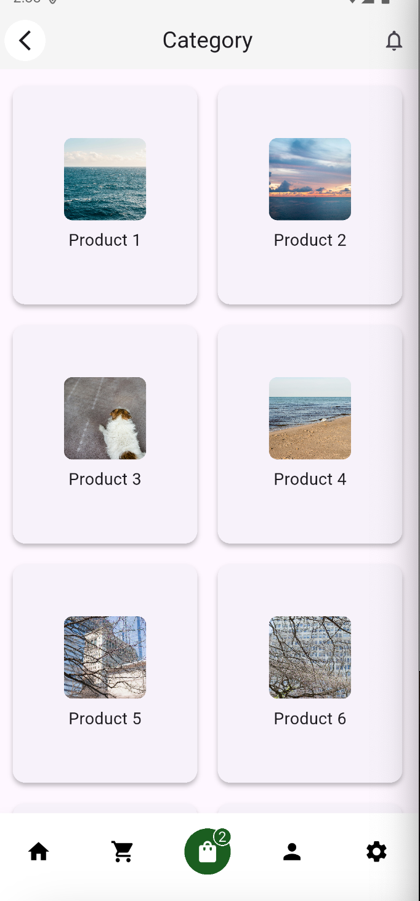
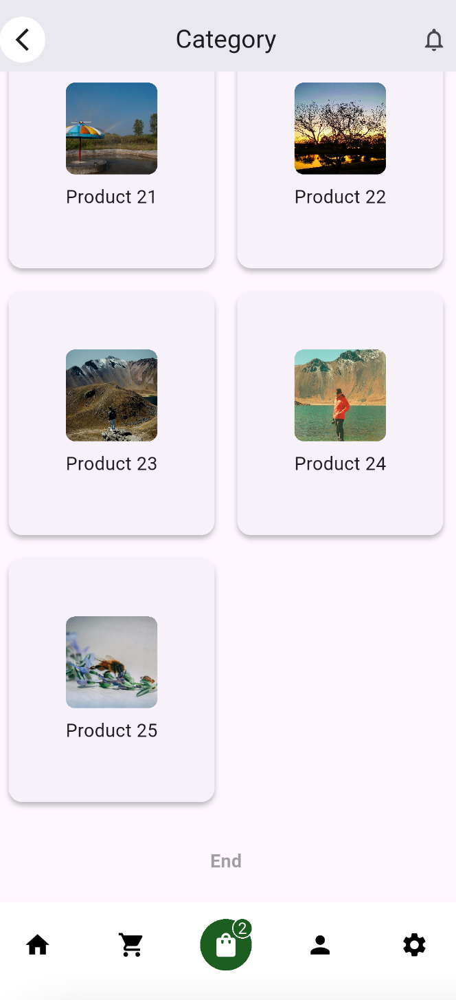

# 📦 Flutter Category App (CodForge Assignment)

A modern, responsive Flutter app that fetches and displays categories from a paginated API using **Riverpod**, **GridView**, and clean UI practices.

Built with 💙 using:
- ✅ Riverpod state management
- ✅ CachedNetworkImage for fast image rendering
- ✅ Infinite scroll with pagination
- ✅ Grid layout inside a scrollable list
- ✅ Clean GitHub workflow

---

## 🚀 Features

- 🔁 Infinite scroll with loading indicator
- 🟩 End-of-list marker (cleanly handled)
- 🔗 API integration (nullable-safe with error & empty state handling)
- 🧹 Modern file structure

---

## 🛠 Folder Structure
```
lib/
├── core/
│   └── service/        # API handling (NetworkService)
├── features/
│   └── category/
│       ├── model/      # Category model
│       ├── provider/   # StateNotifier + Riverpod logic
│       └── view/       # UI (category_screen.dart)
├── widgets/            # Shared components
main.dart
```

---

## 🧑‍💻 Setup Instructions

1. **Clone the repo**
```bash
git clone https://github.com/Codeclopedia/codforge
cd codforge
```

2. **Install dependencies**
```bash
flutter pub get
```

3. **Run the app**
```bash
flutter run
```

---

## 🧪 Test API (Optional)

You can use this test API for pagination:
```http
https://02fdf286-2576-494c-b1f5-843e6611ca1b.mock.pstmn.io/products
```

---


## 🧊 Want to Contribute?

1. Fork this repo
2. Create a feature branch
3. Submit a pull request

---

## 📷 Screenshots




---
